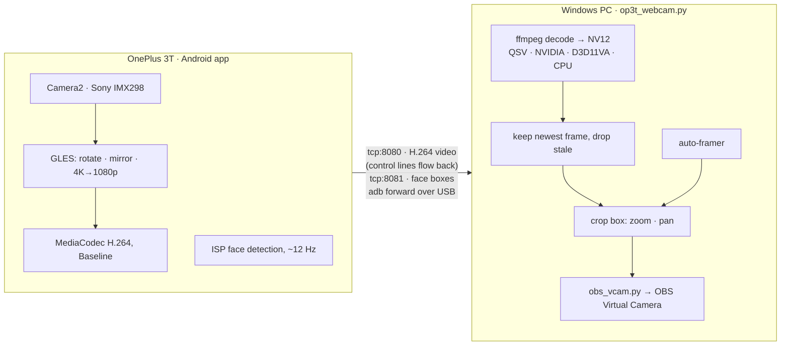

# OP3T Webcam

Turn a **OnePlus 3T** into a low-latency **1080p60 USB webcam** for Windows.

The phone encodes H.264 in hardware and streams it over USB; the PC decodes it on the GPU and feeds
it into **OBS Virtual Camera**, so it works anywhere a webcam does: Zoom, Discord, Teams, Meet, OBS.

- **1080p at 60 fps**, or **30 fps supersampled from a 4K readout** (downscaled on the phone's GPU, so the PC decodes 1080p either way)
- **USB only**: an `adb forward` tunnel, no Wi-Fi setup
- **Low latency**: ~22 ms median decode + pipe at 1080p60 ([measured](windows/latency_baseline.txt)). The newest frame always wins, so nothing queues.
- **Auto-frame**: face-tracking zoom and pan, driven by the phone ISP's own face detector
- **Live controls**: zoom/pan crop box, sensor zoom, exposure, manual focus, torch, bitrate, orientation, mirror/flip, low-light mode
- **Starts by itself**: turn the camera on in Discord, Zoom or anything else and the phone wakes and streams within ~5 s; turn it off and the phone goes back to sleep
- **Lives in the tray**: opens maximised, closes to the tray, and can start with Windows
- **OLED saver**: the phone screen goes black after 30 s of streaming (tap to wake)

## How it works



Rotation, mirroring and noise reduction happen on the phone (GPU and ISP). The PC does no image
processing beyond the zoom/pan crop, and keeps frames in NV12 from decoder to virtual camera.

## Requirements

**Phone:** OnePlus 3T (A3003) on Android 9 with **USB debugging** enabled. The app targets Android 9+
Camera2 and may run on other phones, but capture sizes, zoom limits and the face-box mapping were
measured on the 3T only.

**PC:** Windows 10 or 11 and **[OBS Studio](https://obsproject.com)**. Installing OBS registers the
virtual camera; you never need to open it.

The portable exe bundles ffmpeg and adb. To run from source you also need:

| Tool | Get it |
|---|---|
| Python 3 (developed on 3.14) | https://www.python.org |
| Python packages | `pip install -r windows/requirements.txt` |
| ffmpeg | `winget install Gyan.FFmpeg`, then open a new terminal |
| adb | [Android SDK Platform-Tools](https://developer.android.com/tools/releases/platform-tools) |

The control panel is [pywebview](https://pywebview.flowrl.com) on the Microsoft Edge WebView2 runtime
(built into Windows 11). Without pywebview the app falls back to a simpler tkinter panel.

## Setup

### 1. Install the Android app

**Prebuilt:** download `OP3T-Webcam.apk` from
[Releases](https://github.com/Megalodon-sharky/OP3T-Webcam/releases/latest) and run
`adb install OP3T-Webcam.apk`, or copy it to the phone and open it there.

**From source**, with the phone plugged in:

```powershell
cd android
.\gradlew installDebug
```

This needs JDK 17+ and the Android SDK: set `ANDROID_HOME`, or open `android/` once in Android Studio
(which writes `local.properties`), or just press **Run** there. The build uses the Gradle 9.2.1
wrapper and Android Gradle Plugin 8.11.1.

The first launch asks for camera permission on the phone. Tap **Allow**.

### 2. Get the Windows app

**Portable exe:** download `OP3T-Webcam.exe` from
[Releases](https://github.com/Megalodon-sharky/OP3T-Webcam/releases/latest). It bundles ffmpeg and
adb, so OBS is the only thing it still needs. To build it yourself, run `windows\build_exe.bat`: it
installs PyInstaller and the Python dependencies, bundles the ffmpeg and adb it finds on your PATH,
and writes a single-file `windows\dist\OP3T Webcam.exe` (~155 MB).

**From source:** install the requirements above, then double-click `windows\OP3T Webcam.vbs` (no
console window) or run `windows\start_webcam.bat` (with a console, for debugging).

## Use it

1. Plug the phone in over USB and accept the *Allow USB debugging* prompt. `adb devices` should list
   it as `device`. Keep only one Android device attached.
2. Start **OP3T Webcam** on the PC. It opens maximised and puts an icon in the tray.
3. In your meeting app, pick **OBS Virtual Camera** and turn the camera on. The phone wakes, opens its
   camera app and streams within about 5 seconds. Turn the camera off and about 10 seconds later the
   phone goes back to sleep. A swipe lock screen is dismissed for you; with a PIN or pattern, unlock
   the phone first.

**Start** and **Stop** still work by hand. A stream you started yourself is never stopped for you,
and a Stop is respected until the meeting app lets go of the camera.

**The tray icon** shows the state (grey waiting, blue connecting, green streaming). Left-click opens
the window; right-click has Start/Stop, the two startup switches and **Quit**. The close button only
hides the window: the app has to keep running to notice an app turning the camera on. Tick **Start
with Windows** and it is always waiting, without ever showing a window. Launching it again just
brings the running copy forward. **Quit** closes the phone app, puts its screen to sleep and shuts
down the adb server.

Settings persist in `%APPDATA%\OP3T Webcam\config.json`.

### How auto-start notices the camera

The OBS Virtual Camera is a DirectShow filter that each capturing app loads into its own process. It
reads frames from a shared-memory section that the producer (this app) creates, and it holds a handle
to that section **only while the app is actually capturing**. Measured with ffmpeg as the capturing
app and Discord alongside it: listing devices or formats never opens it, a capture opens it within
0.25 s and closes it the instant it stops, and Discord's capture process held exactly one handle
while its camera was on. So while it waits, OP3T Webcam keeps the virtual camera alive with black
frames (10 fps, about 1% of a core) and counts handles on the section, four times a second. The
stream then takes over the same camera, so the app that turned it on never sees it drop. An app must
hold the camera for 0.5 s before the phone is woken.

The catch: while auto-start is on, this app holds the OBS Virtual Camera, so **OBS Studio's own
virtual camera cannot start**. Untick auto-start (or quit from the tray) when you need OBS's.

## Controls

The panel groups controls by how often you touch them. **Framing** and **Image** stay visible for
mid-call tweaks; **Setup** is collapsed because you set it once. Only the two controls marked
*restarts* interrupt the stream; everything else applies live.

| Control | Group | What it does |
|---|---|---|
| **Auto-frame** | Framing | Face-tracking zoom and pan. The phone reports face rectangles about 12 times a second and the PC steers the crop box to hold your face at a steady size and position: step back and it zooms in, lean in and it zooms out, move sideways and it follows. Dragging or scrolling the preview takes control back. |
| **Zoom** / **Framing tightness** | Framing | One slider. With Auto-frame off it is **Zoom**, a PC-side digital crop of 1.0–4.0× (drag the box in the preview to pan). With Auto-frame on it becomes **Framing tightness**, how much of the frame your face should fill. |
| **Sensor zoom** | Framing | **Off / Auto / On**: who does the magnification. *Off*: the PC crop does it all. *On*: the phone crops its own sensor at a fixed 1.0–2.4× (2.4× is the last ratio whose sensor crop is still at least 1920 px wide, so it stays lossless). *Auto*, meant for Auto-frame: the phone takes over only once the PC crop is pinned at its 2.0× limit and you are still small in frame, and hands it back as you come closer. With Auto-frame off it never zooms in by itself; zooming out hands back anything it still holds. The catch: the 3T can only crop from the centre, so sensor zoom cannot pan. Default is Off. |
| **Exposure** | Image | Exposure compensation, −6 to +6 steps. |
| **Focus** | Image | Far left is autofocus. Anywhere else locks the lens at a manual distance (further right is closer). **Refocus once** runs a single autofocus. Autofocus fires once at start and then parks the lens, so it never hunts mid-call. |
| **Flash** | Image | Rear LED torch. |
| **Frame rate** | Setup | 60 or 30 fps (*restarts*). 60 reads the sensor out at 1080p; 30 reads it out at 4K and downscales on the phone GPU for a cleaner, more detailed picture. |
| **Decoder** | Setup | Intel QSV (default), NVIDIA, D3D11VA or CPU (*restarts*). If a GPU decoder produces no frame within 4 s, the app falls back to CPU decode by itself. |
| **Orientation** | Setup | 0 / 90 / 180 / 270°, rotated on the phone GPU. |
| **Quality** | Setup | Encoder bitrate: 8, 12 (default), 16 or 20 Mbps. |
| **Mirror / Flip** | Setup | Horizontal mirror and vertical flip, on the phone GPU. |
| **Noise reduction** | Setup | Low-light mode: high-quality ISP noise reduction, and auto-exposure may drop to ~7 fps for longer, cleaner exposures. |
| **Start when an app turns the camera on** | Setup, tray | Auto-start (on by default). Off brings back the old behaviour: only Start starts the stream, and the virtual camera exists only while streaming. |
| **Start with Windows** | Setup, tray | Adds a per-user login entry (no admin) that starts the app hidden in the tray. |
| **Preview** | — | 640×360 at 30 fps: the full frame with the crop box drawn on it. Drag to pan, scroll or drag the corner to zoom, double-click to reset. Off by default. |

The status bar shows the stream state, fps, frame count and dropped frames.

## Command line

```powershell
python windows\op3t_webcam.py --test                            # moving test pattern, no phone needed
python windows\op3t_webcam.py --headless                        # 1080p60, no GUI
python windows\op3t_webcam.py --headless --fps 30 --autoframe   # 4K-supersampled 30 fps, face tracking
python windows\op3t_webcam.py --headless --decoder CPU
```

| Flag | Default | Values |
|---|---|---|
| `--fps` | `60` | `60`, `30` |
| `--decoder` | `"GPU (Intel QSV)"` | `"GPU (NVIDIA)"`, `"GPU (Intel QSV)"`, `"GPU (d3d11va)"`, `CPU` (quote the names with spaces) |
| `--rotation` | `0` | `0`, `90`, `180`, `270` |
| `--autoframe` | off | face-tracking zoom + pan |
| `--sensor-zoom` | `off` | `off`, `auto`, `on` |
| `--sensor-zoom-x` | `1.0` | fixed ratio for `--sensor-zoom on`, 1.0–2.4 |
| `--width` / `--height` | `1920` / `1080` | the phone picks the largest size its encoder supports within this |
| `--host` / `--port` | `127.0.0.1` / `8080` | |
| `--tray` | off | start the GUI hidden in the tray (what Start with Windows runs) |

## Protocol

Two ports, both carried over `adb forward`.

**tcp:8080: video and control.** On connect the PC sends one line, `WIDTHxHEIGHT@FPS` (for example
`1920x1080@60`). The phone answers with a raw H.264 Annex-B stream (no container) and keeps reading
newline-terminated control lines from the PC on the same socket:

| Line | Effect |
|---|---|
| `XFORM <rot> <h> <v>` | rotation (0/90/180/270) plus mirror and flip flags, applied on the GPU |
| `EV <steps>` | exposure compensation, clamped to the sensor's range |
| `FOCUSDIST <0..1>` | manual focus, 1 = closest; `0` returns to autofocus |
| `FOCUS` | one-shot autofocus |
| `FLASH <0\|1>` | torch |
| `NR <0\|1>` | low-light noise-reduction mode |
| `BITRATE <mbps>` | live encoder bitrate |
| `ZOOM <ratio> [cx cy]` | sensor crop zoom (always centred on the 3T) |

**tcp:8081: face feed (phone to PC).** A header `A <left> <top> <width> <height> <sensorOrientation>`
describing the sensor's active array, then about 12 times a second
`F <timestamp_us> <cropL> <cropT> <cropW> <cropH> <capW> <capH> <n>` followed by `n` lines of
`<left> <top> <width> <height> <score>`. Rectangles are raw active-array coordinates, sent together
with the crop region the camera *actually applied*. All geometry happens on the PC, so a mapping fix
never needs an APK rebuild.

## Why it's fast

**Phone:** H.264 Baseline profile with no B-frames (no reordering), `KEY_LATENCY=1` so the encoder
emits each frame as soon as it is encoded, realtime codec priority, video stabilisation off, and a
pinned auto-exposure frame rate.

**PC:**

- ffmpeg runs at high priority with `-flags low_delay -fpsprobesize 0 -fps_mode passthrough -flush_packets 1`.
  `-flush_packets 1` alone recovered a whole frame (40 → 22 ms): without it ffmpeg holds the tail of
  every frame in its output buffer until the next frame pushes it out.
- NV12 from decoder to virtual camera, with no colour conversion anywhere.
- A pipe wider than one frame, so each frame is about one read instead of 95.
- A reader that keeps only the newest decoded frame. If the PC stalls, frames are dropped rather than
  queued, so latency cannot build up.
- Intel QSV runs with `-async_depth 1 -extra_hw_frames 2`, which bounds its surface pool (78 → 40 ms).
- **Do not add `-fflags nobuffer`.** On this stream it makes the H.264 parser stall, and it starves
  QSV's surface pool until decoding hangs.

Decode + pipe latency at 1080p60 on the development machine, from
[`windows/latency_baseline.txt`](windows/latency_baseline.txt):

| Decoder | Decode + pipe | ffmpeg CPU | First frame |
|---|---|---|---|
| Intel QSV (default) | ~22 ms median | ~23% of one core | ~0.8 s |
| CPU (`-threads 1`) | 26–42 ms | ~53% of one core | ~50 ms |
| NVIDIA (`h264_cuvid`) | 59–62 ms | ~23% of one core | ~330 ms |

The CPU and NVIDIA rows come from an earlier run, and run-to-run spread on that machine is large, so
treat the table as indicative. QSV decodes on the otherwise idle Intel iGPU; the NVIDIA decoder also
keeps the discrete GPU's 3D engine busy. D3D11VA silently fell back to software decode there, because
that machine's first display adapter is a virtual one. Phone-side latency (capture to socket) is
logged once a second: `adb logcat -s CameraStreamer`.

## Troubleshooting

- **Stuck on "waiting for phone"**: `adb devices` must say `device`, not `unauthorized` or `offline`.
  The app re-forwards the ports and relaunches the phone app every few seconds, and restarts the adb
  server if the link has gone offline. Also check that camera permission was allowed on the phone.
- **No "OBS Virtual Camera" in your app**: install OBS Studio. If the meeting app was already running
  before you clicked Start, quit it fully and reopen it.
- **Black video with a GPU decoder**: after 4 s the app falls back to CPU decode on its own. To skip
  the wait, pick another decoder under Setup. QSV needs an Intel iGPU; NVIDIA needs an NVIDIA GPU.
- **Phone shows `EADDRINUSE`**: a stale instance still holds the port. Run
  `adb shell am force-stop com.op3t.webcam` and start again.
- **Frame rate drops in a dark room**: that is Noise reduction trading frame rate for exposure. Turn it
  off to pin the frame rate.
- **The panel opens but its controls do nothing**: check `%APPDATA%\OP3T Webcam\js_error.log`, where
  the web panel records its own errors.
- **Turning the camera on does nothing**: the app must be running (tray icon present; tick **Start
  with Windows** so it always is), and **Start when an app turns the camera on** must be ticked. A
  phone with a PIN or pattern lock has to be unlocked.
- **OBS Studio says its virtual camera is in use**: OP3T Webcam holds it while auto-start waits. Untick
  auto-start or quit from the tray.
- **Windows Firewall asked about `adb.exe` on every launch** (before this version): the exe unpacks adb
  into a new temp folder each time, and adb's wireless-debugging discovery listened on the network,
  so Windows asked again for every new path. The app now starts adb with `ADB_MDNS=0`, which opens
  nothing but `127.0.0.1`, so there is nothing to ask about. To delete the rules the old prompts left
  behind (one per launch), run this in an **administrator** PowerShell. It matches only those temp
  copies, not a real adb install:

  ```powershell
  Get-NetFirewallApplicationFilter | Where-Object Program -like '*\_MEI*\tools\adb.exe' | Get-NetFirewallRule | Remove-NetFirewallRule
  ```

## Development

```powershell
python windows\test_autoframe.py   # auto-framing maths: isotropic face mapping, frame-rate-independent smoothing
python windows\test_webui.py       # every api.* call in the panel exists, every element id it touches exists
python windows\test_panel.py       # runs the panel's real JavaScript in Node against a stub DOM (skips without Node)
python windows\test_autocam.py     # auto-start timing and the virtual-camera hand-off, against a fake camera
python windows\test_obs_vcam.py    # the virtual-camera writer: memory layout, then a round trip through OBS's own filter
python windows\latency_probe.py    # per-stage latency; close the app first, the phone serves one client at a time
```

The tests are plain-assert scripts with no framework; each exits non-zero on failure.

- [`docs/autoframe-PRD.md`](docs/autoframe-PRD.md) and [`docs/autoframe-plan.md`](docs/autoframe-plan.md):
  auto-framing design, measurements and implementation notes.
- [`.claude/`](.claude): Claude Code project tooling. A `latency-verifier` agent, a `/reprobe` skill,
  and hooks that byte-compile edited Python and warn when `windows\dist\OP3T Webcam.exe` is older than
  the source.
- Phone logs: `adb logcat -s OP3TWebcam CameraStreamer GlFlipRenderer`.

### Layout

```
android/                        Android app (Java, minSdk 28)
  app/src/main/java/com/op3t/webcam/
    MainActivity.java           TCP servers (8080 video + control, 8081 faces), OLED dimming
    CameraStreamer.java         Camera2 session, H.264 encoder, live controls, face publisher
    GlFlipRenderer.java         GPU rotate / mirror / 4K→1080p downscale
windows/
  op3t_webcam.py                receiver: adb, ffmpeg pipeline, auto-framing, tkinter fallback, CLI
  webui.py                      pywebview control panel
  obs_vcam.py                   OBS Virtual Camera writer (the shared memory OBS's filter reads)
  build_exe.py, build_exe.bat   PyInstaller single-file build with ffmpeg + adb bundled
  latency_probe.py              per-stage latency measurement
  latency_baseline.txt          recorded measurements
  test_*.py                     self-checks
  OP3T Webcam.vbs               launcher without a console window
  start_webcam.bat              launcher with a console
docs/                           auto-framing PRD and implementation plan
```

## OnePlus 3T notes (measured on device)

- Snapdragon 821 with an Adreno 530 GPU; rear camera is a Sony IMX298 (16 MP), active array 4656×3496.
- The H.264 encoder handles 4K at 30 fps; a 4K readout cannot sustain 60 fps.
- Camera HAL: maximum digital zoom 4.0×, `croppingType` is `CENTER_ONLY` (a sensor crop cannot pan),
  and face detection is `SIMPLE` only (up to 10 faces, no landmarks or IDs).

## License

[MIT](LICENSE) for the code in this repository. The release exe also bundles third-party software
under its own licenses: FFmpeg (GPL-3.0, [gyan.dev](https://www.gyan.dev/ffmpeg/builds/) build), adb
from Android SDK Platform-Tools (Apache-2.0), OpenCV (Apache-2.0), numpy (BSD-3-Clause), pywebview
(BSD-3-Clause), and pythonnet and bottle (MIT). FFmpeg and adb run as separate programs.

The virtual-camera writer, [`windows/obs_vcam.py`](windows/obs_vcam.py), is this project's own code. The
v1.0.0 exe used pyvirtualcam (GPL-2.0-only) for that part, which does not combine with OpenCV's
Apache-2.0 license; v1.1.0 and later ship without it.
